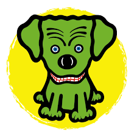

<div align="center">
    
</div>

<br>
<br>
<h1 align="center">Control THORLABS<sup>&reg;</sup> CLD1015 in Flask</h1>
<br>
a Python Project to control THORLABS CLD1015 through Web Brower.

## Introduction

This Flask project runs on a local computer that connects the CLD1015 through USB as a server. Any LAN devices can send command to the CLD1015 through web brower.

You can turn on/off the LD and change the current setpoint easily.


  
> **Note**
> Once the command is sent, the CLD1015 will be in the remote control state, and the remote icon on the panel will be lit.

> **Warning**
> Once the CLD1015 is in the remote control state, the local operation will be prohibited unless the local button on the panel is touched.

## Usage
```bash
git clone https://github.com/LeonoreShaw/CLD1015.git
```

## Contributing

Pull requests are welcome. For major changes, please open an issue first
to discuss what you would like to change.

Please make sure to update tests as appropriate.

## License

    MIT License

    Copyright (c) 2023 Léonore Shaw

    Permission is hereby granted, free of charge, to any person obtaining a copy
    of this software and associated documentation files (the "Software"), to deal
    in the Software without restriction, including without limitation the rights
    to use, copy, modify, merge, publish, distribute, sublicense, and/or sell
    copies of the Software, and to permit persons to whom the Software is
    furnished to do so, subject to the following conditions:

    The above copyright notice and this permission notice shall be included in all
    copies or substantial portions of the Software.

    THE SOFTWARE IS PROVIDED "AS IS", WITHOUT WARRANTY OF ANY KIND, EXPRESS OR
    IMPLIED, INCLUDING BUT NOT LIMITED TO THE WARRANTIES OF MERCHANTABILITY,
    FITNESS FOR A PARTICULAR PURPOSE AND NONINFRINGEMENT. IN NO EVENT SHALL THE
    AUTHORS OR COPYRIGHT HOLDERS BE LIABLE FOR ANY CLAIM, DAMAGES OR OTHER
    LIABILITY, WHETHER IN AN ACTION OF CONTRACT, TORT OR OTHERWISE, ARISING FROM,
    OUT OF OR IN CONNECTION WITH THE SOFTWARE OR THE USE OR OTHER DEALINGS IN THE
    SOFTWARE.
